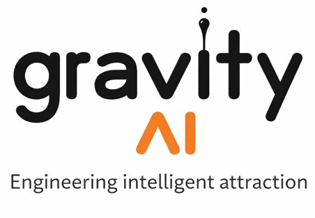

<!-- HERO (banner + profile) -->

  

    
  

  

    
  

<h1>
  Welcome to 
  GRAVITY
  by Sana Ijlal Shahrukh
</h1>

***Engineering Intelligent Attraction***

Gravity builds intelligent systems by engineering intelligent attraction between data, models, and decisions.

---

## About Me
I am a biomedical engineer with 15+ years of experience spanning medical devices, signal processing, and higher education. My current focus is on AI and data-driven systems that translate complex biomedical data into actionable clinical insights. I build solutions at the intersection of biomedical instrumentation, computational modeling, and intelligent analytics, informed by real-world healthcare constraints. With a strong foundation in electronics and biosignals, I aim to design scalable, patient-centered technologies powered by modern data science. 

---

## Education
- *Master of Science* **(Analytics)** *January 2026-Present* —  Georgia Institute of Technology. Atlanta, GA, USA.

- *Master of Engineering* **(Electronics Engineering)** — NED University of Engineering & Technology. Karachi, Pakistan.

- *Bachelor of Science* **(Biomedical Engineering)** — Sir Syed University of Engineering & Technology. Karachi, Pakistan.

---

## Experience
- **Lecturer / Lab Engineer** — Imam Abdulrahman Bin Faisal University (2016 - 2024)
  - **Assistant Professor** — Sir Syed University of Engineering & Technology (2007 - 2014)
- **Biomedical Service Engineer** — Biotech Pakistan Pvt. Ltd. (2005 - 2007)
    

---

## Skills
**Programming & Embedded Systems**

Python • C / C++ • Arduino • Matlab • R • LabVIEW

**Electronics & Hardware**

Electronics & Circuits • Sensors & Electrical Components • Embedded System Integration

**Design & Productivity Tools**

Adobe Illustrator • Canva • Microsoft Office (Word, Excel, PowerPoint)

---

## Contact
- Email: [Sana Ijlal Shahrukh](mailto:sanahyder@gmail.com)
- GitHub: [sanaijlal](https://github.com/sanaijlal)
- LinkedIn: [Sana Ijlal Shahrukh](https://www.linkedin.com/in/sana-ijlal-shahrukh-558b8286/)

---

## Download my CV
[Download my CV](assets/Sana_Ijlal_CV.pdf){ .md-button .md-button--primary }

## My Social Media links

-[GitHub](https://github.com/sanaijlal)    - [Google Scholar](https://scholar.google.com/citations?user=uICtX4wAAAAJ&hl=en) - [LinkedIn](https://www.linkedin.com/in/sana-ijlal-shahrukh-558b8286/) - [X/Twitter](https://x.com/SanaIjlal) - [Facebook](https://www.facebook.com/share/1DXp5T3JRV/?mibextid=wwXIfr) - [Instagram](https://www.instagram.com/sana_ijlal?igsh=MXV0ZTdzNWlvdDJ0Zg%3D%3D&utm_source=qr) - [YouTube](https://www.youtube.com/@SanaHKhan-is8bq)

